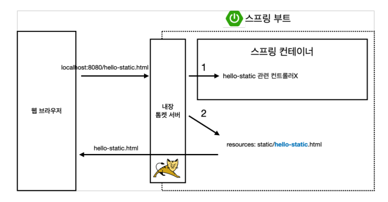
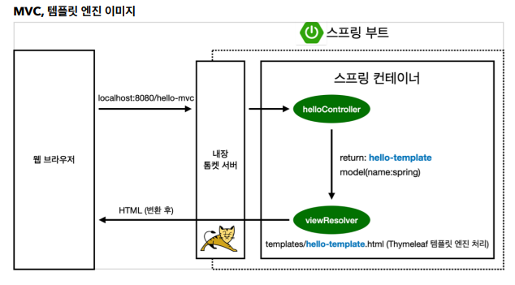
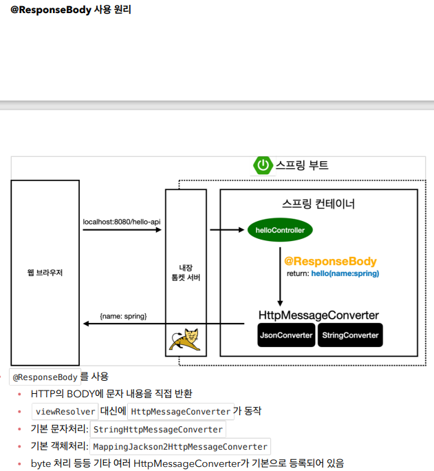
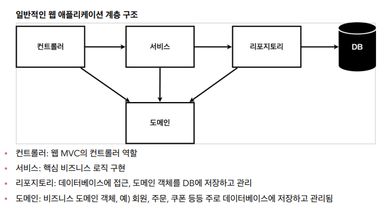
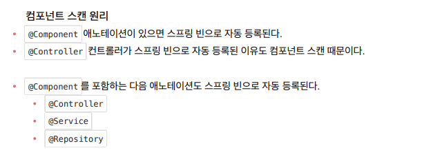
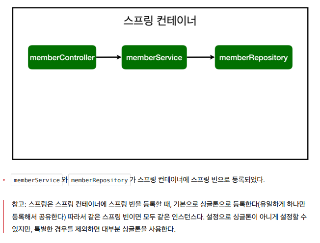
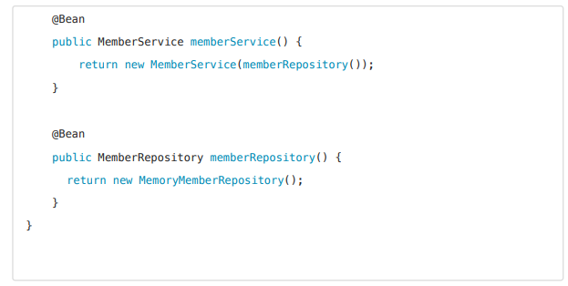
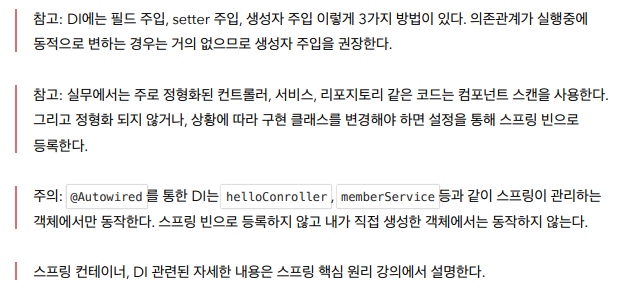

# Spring Boot introduction 
### 해당 repository는 Spring Boot Study입니다.
***
- 프로젝트 환경설정
- 스프링 웹 개발 기초 ( 정적 컨텐츠, MVC와 템플릿 엔진, API )
  
  
  
  
  
- 회원 관리 예제 - 백 엔드 개발
  
    - 비즈니스 요구사항 정리
    - 회원 도메인과 리포지토리 만들기
    - 회원 리포지토리 테스트 케이스 작성
    - 회원 서비스 개발
    - 회원 서비스 테스트
- 스프링 빈과 의존관계
    - 컴포넌트 스캔과 자동 의존관계 설정
  
      
      
      
    - 자바 코드로 직접 스프링 빈 등록하기
      
      
      