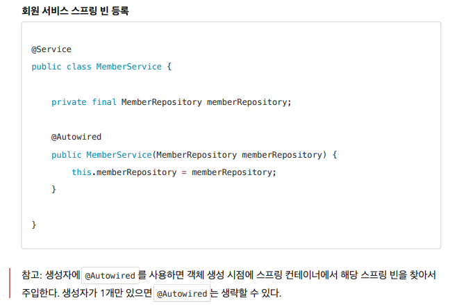

# Spring Boot introduction 
### 해당 repository는 Spring Boot Study입니다.
***
- 프로젝트 환경설정
- 스프링 웹 개발 기초 ( 정적 컨텐츠, MVC와 템플릿 엔진, API )
  
  
  
  
  
- 회원 관리 예제 - 백 엔드 개발
  
    - 비즈니스 요구사항 정리
    - 회원 도메인과 리포지토리 만들기
    - 회원 리포지토리 테스트 케이스 작성
    - 회원 서비스 개발
    - 회원 서비스 테스트
- 스프링 빈과 의존관계
    - 컴포넌트 스캔과 자동 의존관계 설정
  
      
      
      
    - 자바 코드로 직접 스프링 빈 등록하기
      
      
- 회원 관리 예제 - 웹 MVC 개발
    - 홈 화면 추가
        - 컨트롤러가 정적 파일보다 우선순위가 높다. ( 같은 매핑을 사용할 경우 컨트롤러가 우선이다. )
    - 회원 웹 기능 - 등록
        - Post , Get 메소드, Form 태그
    - 회원 웹 기능 - 조회
      - Get method 이용하여 조회
- 스프링 DB 접근 기술
    - H2 데이터베이스 설치
        - MySQL을 보통 씀
    - 순수 JDBC
        - 
        - OCP 개방 폐쇄 원칙 (Open-Closed Principle) : 확장에는 열려 있고, 수정, 변경에는 닫혀 있다.
        - 스프링의 DI를 사용하여 코드 수정을 하지 않고, 설정 만으로 구현 클래스를 변경 할 수 있다.